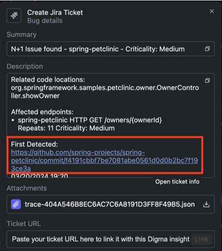

# Local Install

## Prerequisites

1. [IntelliJ](https://www.jetbrains.com/idea/) Community or Ultimate Edition
2. An application running [Java](https://www.java.com/en/) or [Kotlin](https://kotlinlang.org/) code
3. Docker installed and running - Can be either [Docker Desktop](https://www.docker.com/products/docker-desktop/), [Podman](https://podman.io/) or [Rancher Desktop](https://rancherdesktop.io/)&#x20;

## 1. Install the Digma plugin in the IDE marketplace

The Digma Plugin is available on the IntelliJ Marketplace.&#x20;

<figure><figcaption></figcaption></figure>

You can install the plugin from your IDE or open the plugin [page](https://plugins.jetbrains.com/plugin/19470-digma-continuous-feedback) in your browser. &#x20;

## 2.  Setup the Digma Analytics Engine

Digma runs locally on your machine. To process all of the captured traces, analyze them, detect issues, and provide analytics, Digma relies on Docker containers. When not ingesting any traces, these containers are completely idle.

After the plugin installs you'll get to choose the preferred way to install the Digma Engine.  Several options are available:

<figure><figcaption></figcaption></figure>

Auto install  (Default)

This is the default option. After installation, the plugin will try to start the Digme Engine containers on your local Docker environment and will offer clear controls to allow you to `Stop` `Start` or `Remove` it.  The benefit of using this approach is that Digma will be able to also update the Engine automatically when a new release becomes available.&#x20;

.png>)

Install Digma via Docker Compose

You can simply install Digma yourself using the Docker Compose file.&#x20;

Simply select the `Docker Compose` tab from the onboarding page and follow the instructions to download the Docker Compose file and run it locally.

.png>)

Notice that you can use this method to deploy to other Docker platforms Both Rancher Desktop and Podman support the Docker Compose spec so you can use [Rancher Compose](https://rancher.com/docs/rancher/v1.6/en/cattle/rancher-compose/) or  [Podman Compose ](https://docs.podman.io/en/latest/markdown/podman-compose.1.html)respectively. &#x20;

Install the Docker Extension

Digma also comes bundled as a Docker Extension. If you're using Docker Desktop you can deploy the Digma Engine straight from the Docker Extensions Marketplace. The benefit is that the Engine will run in its own system space and will not create any confusion with the rest of the containers you may be running for other use cases.

You can install the Digma Extension from the Docker Marketplace or by visiting the [extension page](https://hub.docker.com/extensions/digmaai/digma-docker-extension).&#x20;

### Digma Analytics Engine architecture

The Digma Engine is defined in a simple Docker Compose [file](https://github.com/digma-ai/digma/blob/main/docker/docker-compose.yml) that is available online and consists of four containers:

* `Digma Compound`- This container holds the Digma backend service for processing traces
* `Digma Persistence` - DBs and storage for processing the time series data and aggregating it
* `Jaeger` - An embedded Jaeger instance that also has additional features for linking spans with code
* `Digma DS` - All of the data science and ML logic for detecting anomalies, calculating correlations, etc

### How do I know Digma is Running?

If you've run Digma via any of the first two options, you can check that the Analytics Engine containers are up and running. In the IDE you should see both the Observability side panel and the Insights side panel showing up with no errors and waiting to receive data.

<figure><figcaption></figcaption></figure>

