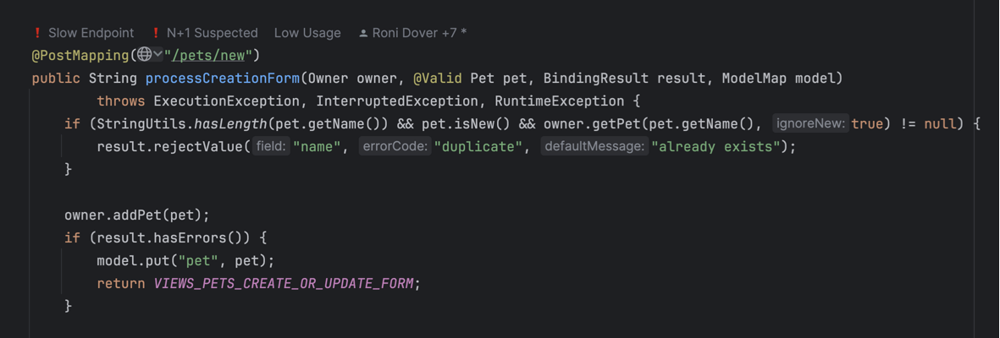

# Environments

### Why it's important to have more than one environment

Digma excels in analyzing observability data, detecting changes, and measuring baselines. Lumping together data from dev, test, load testing, and production would create a huge mess with many strange statistical artifacts. Each time you run a load test you'll notice huge performance degradations while running in debug mode would manifest bugs in code that hasn't yet been checked in.

To bring some order into this chaos, Digma uses environments as an abstraction to measure data from different deployment stages and use cases separately.

### The default environment

By default, all observability data received by the Digma Analytics Engine is lumped in the `LOCAL`or `LOCAL_TESTS` environments if you've installed Digma locally on your machine. The latter environment will automatically ingest any observability from your local test runs in the IDE.

Once you've installed Digma centrally all untagged traces will immediately be lumped under the `UNSET` environment. However, this should be a temporary state and we strongly recommend to create named environments for each of your observability sources.

### Private vs. Shared Environments

Private environments are environments only you have access to. If you're running Digma locally this is also the only environment you can create - seeing as you're also the only user!

Once you've installed Digma centrally you can create shared environments that are accessible to multiple users. A good example would be setting up a Digma environment for your CI or Staging.

### How to create environments

Beyond the default environments, creating additional private or shared environments requires registering for a Digma Account (which is free and available at this [link](https://digma.ai/sign-up)).&#x20;

Private environments are easy to create in your local deployment from the Observability Panel and through the `Add Environment` button.&#x20;

<figure><figcaption></figcaption></figure>

### Tagging the application data to the new environment

To learn how to save the application observability data under the environment you've created, click on the 'How to setup' option in the environment tab context menu:

<figure><figcaption></figcaption></figure>

