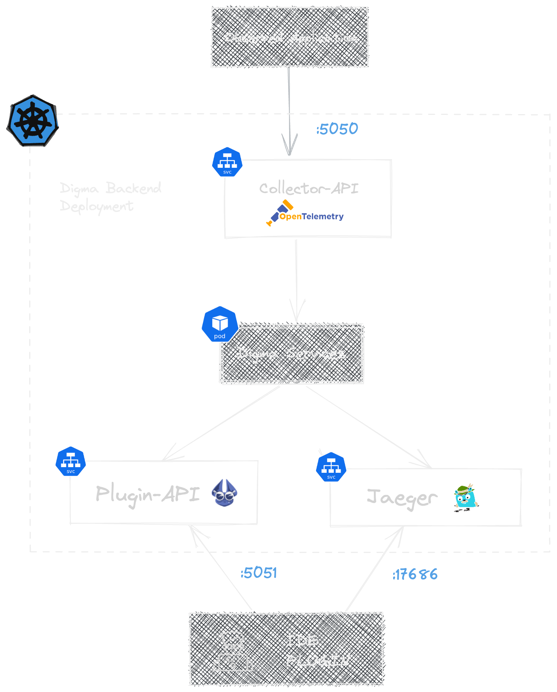

# Central (on-prem) Install

### Understanding the Deployment Architecture

Digma is deployed into the K8s cluster into its own namespace. Depending on your application deployment architecture you may want to deploy Digma with different parameters to enable the right connectivity.\


<figure><figcaption></figcaption></figure>

You should pay attention to the following regarding the deployment architecture:

* **Collector-API** – This architecture assumes that the application can send observability data to the IP/DNS of this endpoint. You may need to configure your setup to allow this traffic. You may also choose to expose it as a public IP in your deployment (see below under Cloud Deployment)
* **Analytics-API** – This endpoint needs to be accessible to the IDE plugin. If you are deploying Digma into your internal network and use a VPN to access that IP you can choose not to expose this service as a public IP (see below under Cloud Deployment).
* **Jaeger** – Digma bundles its own Jaeger service that aggregates sample traces for various insights, performance metrics, and exceptions. If you do not wish to expose this endpoint or prefer to configure your APM as the trace source, you can choose to disable this endpoint. Digma does offer enhancements over Jaeger such as a two-way mapping between the code and the trace.

### Deploying the Digma backend <a href="#deployment" id="deployment"></a>

Prerequisites:&#x20;

* Access to a  [Kubernetes](https://kubernetes.io/) cluster&#x20;
* [Helm](https://helm.sh/docs/intro/install/) installed locally
* [Create a free Digma Account](https://digma.ai/sign-up) and receive back a license token

The recommended way to install Digma in your org is using our Helm chart.

**Step 1: Add the Digma Helm repo**

```bash
helm repo add digma https://digma-ai.github.io/helm-chart/
helm repo update
```

**Step 2: Deploy Digma using Helm**

You’ll need to provide the following parameters in the example below:

* **DIGMA\_LICENSE (string)** - If you've signed up for a free Digma account you should have received a Digma license to use. You can use this link to sign up: [Create a free Digma Account](https://digma.ai/sign-up)


```bash
helm install digma digma/digma --set licenseKey=[DIGMA_LICENSE] --namespace digma --create-namespace
```


**Other optional parameters:**

* `digmaAnalytics.accesstoken`(any string): This is a unique key you’ll need to provide any IDE that connects to this Digma instance, you can choose any token you'd like.&#x20;
* `embeddedJaeger.enabled`  (true/false) – Setting this to False will not expose the port for the Jaeger instance included with Digma. If you’re using your own APM and want to link to that instead, you can leave that at the default value (false)

**Cloud Deployment**

If you’re deploying Digma to a cloud Kubernetes provides such as EKS/AKS or just a publicly hosted K8s cluster, there are additional control parameters you can set:

* `digmaAnalytics.expose` (true/false): Controls whether the API used to communicate with the IDE plugin is exposed via a public IP (though protected with the `digmaAnalytics.accesstoken` if set) or on the internal network only
* `digmaCollectorApi.expose` (true/false): Controls the same setting for the collector API (receiving inbound observability from your application)

**Step 3: Validating the deployment**

To check everything is working properly we can check the pod status and make sure they are all in the ‘Running’ state:

`kubectl get pods -n digma`

For example, this is the expected output:

<figure><figcaption></figcaption></figure>

**Step 4: Get the IP/DNS value for the Digma deployment**

Run the following command to get the address assigned to the **Collector**, **Plugin-API,** and **Jaeger** endpoints (if enabled). You’ll need these to complete the setup. Note that external load balancers for public IPs may take additional time to set up the address.

`kubectl get services --namespace digma`

Depending on your setup type get the public or internal IP for the following services:

* Collector-API: `digma-collector-api` or `digma-collector-api-service-lb` if you have selected to expose this service externally
* Analytics-API: `digma-analytics-service-lb`
* Jaeger: `digma-embedded-jaeger-lb`

Capture these addresses as you’ll need them later to setup your IDE plugin.

**Step 5: Final validation**

You can try calling the following API to validate connectivity and ensure Digma is up and running. You’ll need to use the ANALYTICS-API address you’ve captured in the above step. If you've set an access token, you need to provide it as well as a header for the request, as seen in the example below:


```bash
curl -k -X ‘GET’ \ ‘https://<ANALYTICS-API>:5051/api/Diagnostic’ \ -H “Authorization: Token <API_TOKEN>” -H ‘accept: application/json’ 

```


If you received a non-error response back you’re good to go for the next step!

### &#x20;Connecting your IDE to the Org Digma deployment

Once Digma is up and running you can now set your IDE plugin to connect to it. To do that, open the plugin settings (Go to IntelliJ IDEA -> Settings/Preferences and search for ‘Digma’)


<figure><figcaption></figcaption></figure>

* Set the `Digma API URL` parameter using the ANALYTICS-API value you’ve captured previously (By default this should be prefixed as ‘https’ and use port 5051)
* Set the `Runtime observability backend URL` parameter using the ‘COLLECTOR-API’ value you’ve captured previously
* Set the `Api token` parameter using the string value you used as an access token if you've provided one during setup. &#x20;
* Set the `Jaeger Query URL`(if this option was enabled) using the JAEGER address you’ve captured previously.

Click `Apply`/`OK` to enable the changes and check that the Digma UI is not showing any connection errors.


\


\
\


